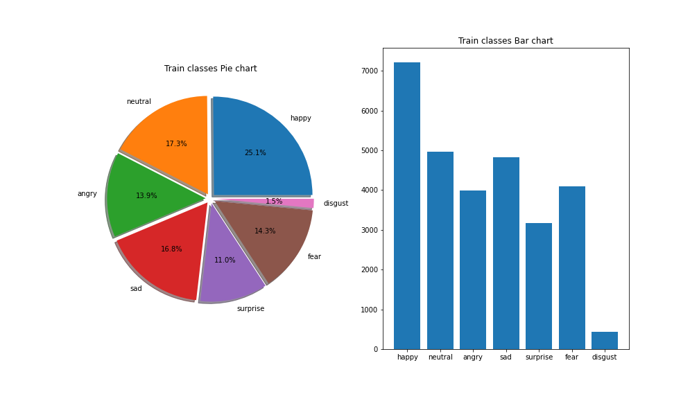
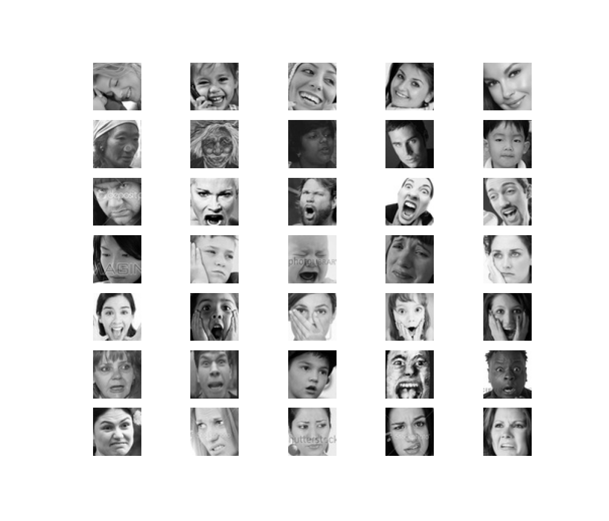
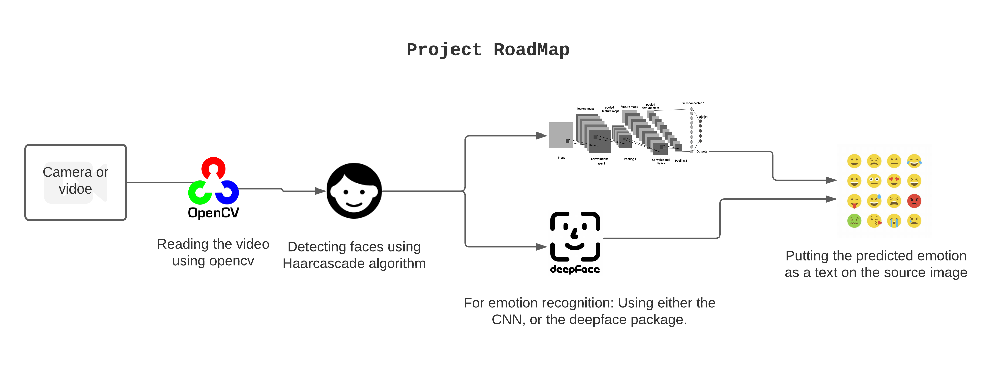

# realtime-face-emotion-recognition
__Done into two main steps__:         
> 1. __Face-detection:__ from the video source using OpenCV and haarcascade algorithm.
> 2. __Emotion recognition:__              
    - __First solution:__ Using a model trained on [FER-2013 dataset](https://www.kaggle.com/msambare/fer2013) with Tensorflow.         
    - __Second solution:__ I've used [DeepFace package](https://github.com/serengil/deepface) as a prefabricated solution.      

## Table of contents
- [The dataset and its challenges](#dataset)
- [High level roadmap for the project](#project-roadmap)
- [Installation](#installation)
- [Technologies Used in this project](#technologies)
- [What did I learn from this project](#what-did-i-learn)
- [LICENCSE](#license)

### Dataset
[__FER 2013__](https://www.kaggle.com/msambare/fer2013) Dataset:
> The data consists of 48x48 pixel grayscale images of faces. The dataset consists of 7 unblanced classes    

__Note that the data has lots of pitfalls:__ 
> __So don't expect a high accuracy on training I got about 70% on the validation set__

- __Imbalanced classes__: you can notice from the below charts that the `happy` class represents __25%__ of the data               
    
- Some other problems exist in the dataset like __occulsion, contrast variation and Intra class variation__:
    

### Project Roadmap

## Installation
- Run It using docker You just simply 

1. `Docker pull 'The DockerHub link For the project'`
1. `docker run -it ImageName`

### Technologies 
- [Tensorflow 2](https://github.com/tensorflow/tensorflow)
- [opencv](https://github.com/opencv)
- Python

### What did I learn
- Working with transefer learning 
- Data Augmentation

### Useful resources
- Here are some Useful resiources you can use
### LICENSE
[***GNU GPL V3***](./LICENSE)
